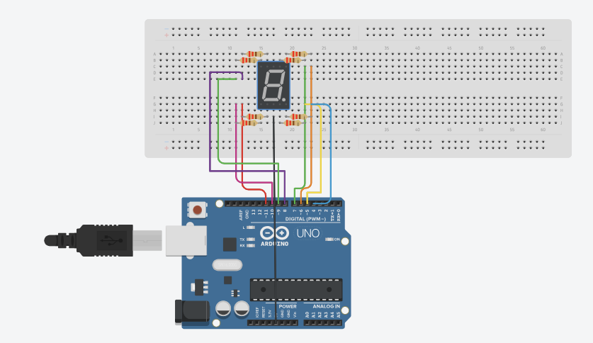

#  Praktikum Sistem Tertanam  
# Modul II: Auto Seven Segment

# Pertanyaan Praktikum

1.Gambarkan rangkaian schematic yang digunakan pada percobaan! <br>
2. Apa yang terjadi jika nilai num lebih dari 15? <br>
3. Apakah program ini menggunakan common cathode atau common anode? Jelaskan alasanya! <br>
4. Modifikasi program agar tampilan berjalan dari F ke 0 dan berikan penjelasan disetiap baris kode nya dalam bentuk README.md! <br>

# Jawaban Pertanyaan Praktikum

# 1. Rangkaian Schematic
Rangkaian pada percobaan ini menggunakan:
- 1 Arduino Uno  
- 1 7-Segment Display (Common Anode)  
- 8 Resistor 220 Ohm
- breadboard
  


# 2. Nilai num lebih dari 15
Jika num > 15:
- Program mengakses memori di luar array
- Data yang terbaca menjadi acak
Dampak:
- Tampilan 7-segment tidak sesuai (glitch)
- Bisa menyebabkan error atau restart pada sistem

# 3. Jenis seven segment
Program menggunakan Common Anode.
Alasan yaitu,
- Hardware: Pin COM terhubung ke 5V
- Software:
```cpp
digitalWrite(segmentPins[i], !digitPattern[num][i]);
```
- Operator ! membalik logika
- Pada Common Anode, LED menyala saat LOW

# 4. Modifikasi program (F -> 0)

```cpp
const int segmentPins[8] = {7, 6, 5, 11, 10, 8, 9, 4};

byte digitPattern[16][8] = {
  {1,1,1,1,1,1,0,0}, // 0
  {0,1,1,0,0,0,0,0}, // 1
  {1,1,0,1,1,0,1,0}, // 2
  {1,1,1,1,0,0,1,0}, // 3
  {0,1,1,0,0,1,1,0}, // 4
  {1,0,1,1,0,1,1,0}, // 5
  {1,0,1,1,1,1,1,0}, // 6
  {1,1,1,0,0,0,0,0}, // 7
  {1,1,1,1,1,1,1,0}, // 8
  {1,1,1,1,0,1,1,0}, // 9
  {1,1,1,0,1,1,1,0}, // A
  {0,0,1,1,1,1,1,0}, // b
  {1,0,0,1,1,1,0,0}, // C
  {0,1,1,1,1,0,1,0}, // d
  {1,0,0,1,1,1,1,0}, // E
  {1,0,0,0,1,1,1,0}  // F
};

void displayDigit(int num) {
  for(int i=0; i<8; i++) {
    digitalWrite(segmentPins[i], !digitPattern[num][i]);
  }
}

void setup() {
  for(int i=0; i<8; i++) {
    pinMode(segmentPins[i], OUTPUT);
  }
}

void loop() {
  for(int i=15; i>=0; i--) {
    displayDigit(i);
    delay(1000);
  }
}
```
Penjelasan Program
- segmentPins → Menyimpan mapping pin Arduino ke segmen
- digitPattern → Pola biner untuk angka 0–F
- displayDigit(num) → Menampilkan angka ke 7-segment
- for (i=0; i<8) → Mengontrol semua segmen
- digitalWrite(..., !...) → Menyesuaikan dengan Common Anode
- setup() → Inisialisasi awal
- loop() → Program utama berulang
- for (i=15; i>=0) → Countdown dari F ke 0
- delay(1000) → Jeda 1 detik

Kesimpulan
- Array digunakan untuk menyimpan pola tampilan angka
- Sistem menggunakan konfigurasi Common Anode
- Program berhasil menampilkan countdown dari F ke 0
- Struktur program menggunakan fungsi dan perulangan agar lebih efisien
