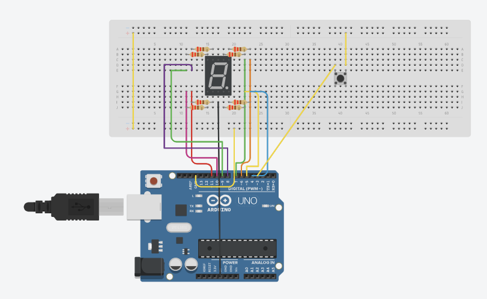

# Modul I: Seven Segment Push Button

# Pertanyaan Praktikum

1. Gambarkan rangkaian schematic yang digunakan pada percobaan! <br>
2. Mengapa pada push button digunakan mode INPUT_PULLUP pada Arduino Uno? Apa keuntungannya dibandingkan rangkaian biasa? <br>
3. Jika salah satu LED segmen tidak menyala, apa saja kemungkinan penyebabnya dari sisi hardware maupun software? <br>
4. Modifikasi rangkaian dan program dengan dua push button yang berfungsi sebagai penambahan (increment) dan pengurangan (decrement) pada sistem counter dan berikan penjelasan disetiap baris kode nya dalam bentuk README.md! <br>

# Jawaban Pertanyaan Praktikum

# 1. Rangkaian Schematic
Rangkaian pada percobaan ini terdiri dari:
- 1 Arduino Uno  
- 1 7-Segment Display (Common Anode)  
- 8 Resistor 220 Ohm  
- 1 Push Button
- Breadboard


# 2. Penggunaan `INPUT_PULLUP`
Mode `INPUT_PULLUP` digunakan untuk mengaktifkan resistor pull-up internal pada Arduino.
### Fungsi:
- Memberikan kondisi default **HIGH** pada pin input  
- Mencegah kondisi *floating* (sinyal acak)
### Cara Kerja:
- Tombol **tidak ditekan** → HIGH  
- Tombol **ditekan** → LOW (terhubung ke GND)
### Keuntungan:
- Tidak perlu resistor eksternal  
- Rangkaian lebih sederhana dan rapi  
- Pembacaan input lebih stabil

# 3. Jika Salah Satu Segmen Tidak Menyala
### Dari sisi Hardware:
- Kabel jumper longgar atau rusak  
- Resistor rusak  
- Pin tidak terhubung dengan benar  
- Segmen LED pada 7-segment rusak  
### Dari sisi Software:
- Kesalahan pada `digitPattern`  
- Urutan pin pada `segmentPins` tidak sesuai  
- Pin belum diatur sebagai OUTPUT di `setup()`

# 4. Modifikasi Program (Increment & Decrement)
## Source Code

```cpp
const int segmentPins[8] = {7, 6, 5, 11, 10, 8, 9, 4};

const int btnUp = 3;   
const int btnDown = 2; 

byte digitPattern[16][8] = {
  {1,1,1,1,1,1,0,0}, // 0
  {0,1,1,0,0,0,0,0}, // 1
  {1,1,0,1,1,0,1,0}, // 2
  {1,1,1,1,0,0,1,0}, // 3
  {0,1,1,0,0,1,1,0}, // 4
  {1,0,1,1,0,1,1,0}, // 5
  {1,0,1,1,1,1,1,0}, // 6
  {1,1,1,0,0,0,0,0}, // 7
  {1,1,1,1,1,1,1,0}, // 8
  {1,1,1,1,0,1,1,0}, // 9
  {1,1,1,0,1,1,1,0}, // A
  {0,0,1,1,1,1,1,0}, // b
  {1,0,0,1,1,1,0,0}, // C
  {0,1,1,1,1,0,1,0}, // d
  {1,0,0,1,1,1,1,0}, // E
  {1,0,0,0,1,1,1,0}  // F
};

int currentDigit = 0;

bool lastUpState = HIGH;
bool lastDownState = HIGH;

void displayDigit(int num) {
  for(int i=0; i<8; i++) {
    digitalWrite(segmentPins[i], !digitPattern[num][i]);
  }
}

void setup() {
  for(int i=0; i<8; i++) {
    pinMode(segmentPins[i], OUTPUT);
  }
  
  pinMode(btnUp, INPUT_PULLUP);
  pinMode(btnDown, INPUT_PULLUP);

  displayDigit(currentDigit);
}

void loop() {
  bool upState = digitalRead(btnUp);
  bool downState = digitalRead(btnDown);

  if(lastUpState == HIGH && upState == LOW) {
    delay(200); 
    currentDigit++;
    if(currentDigit > 15) currentDigit = 0; 
    displayDigit(currentDigit);
  }

  if(lastDownState == HIGH && downState == LOW) {
    delay(200); 
    currentDigit--;
    if(currentDigit < 0) currentDigit = 15; 
    displayDigit(currentDigit);
  }

  lastUpState = upState;
  lastDownState = downState;
}
```
Penjelasan Program
1. Inisialisasi Pin
- segmentPins
  Menyimpan pin Arduino yang terhubung ke segmen a–dp.
- btnUp dan btnDown
  Menentukan pin untuk tombol naik dan turun.
2. Pola Angka
- digitPattern[16][8]
  Array yang menyimpan pola biner untuk menampilkan angka 0 sampai F.
3. Variabel Kontrol
- currentDigit
  Menyimpan nilai angka yang sedang ditampilkan.
- lastUpState dan lastDownState
  Menyimpan kondisi tombol sebelumnya untuk mendeteksi perubahan (edge detection).
4. Fungsi displayDigit()
```cpp
digitalWrite(segmentPins[i], !digitPattern[num][i]);
```
- Mengatur nyala/mati tiap segmen
- Operator ! digunakan karena Common Anode
- Segmen menyala saat bernilai LOW
5. Fungsi setup()
- Mengatur semua pin segmen sebagai OUTPUT
- Mengaktifkan INPUT_PULLUP untuk tombol
- Menampilkan angka awal (0)
6. Fungsi loop()
a. Membaca tombol
```cpp
bool upState = digitalRead(btnUp);
bool downState = digitalRead(btnDown);
```
- HIGH → tidak ditekan
- LOW → ditekan
b. Tombol UP (Increment)
```cpp
if(lastUpState == HIGH && upState == LOW)
```
- Mendeteksi tombol baru ditekan
- currentDigit++ → tambah nilai
- Jika > 15 → kembali ke 0
c. Tombol DOWN (Decrement)
```cpp
if(lastDownState == HIGH && downState == LOW)
```
- currentDigit-- → kurangi nilai
- Jika < 0 → kembali ke 15
d. Debouncing
```cpp
delay(200);
```
- Menghindari pembacaan ganda akibat getaran tombol
e. Update State
```cpp
lastUpState = upState;
lastDownState = downState;
```
- Menyimpan kondisi tombol untuk loop berikutnya

# Kesimpulan
- Sistem berhasil mengontrol counter menggunakan dua tombol
- Menggunakan Common Anode sehingga logika dibalik (!)
- INPUT_PULLUP membuat rangkaian lebih sederhana
- Edge detection memastikan tombol tidak terbaca berulang
Counter memiliki sistem wrap-around (0 ↔ F)
